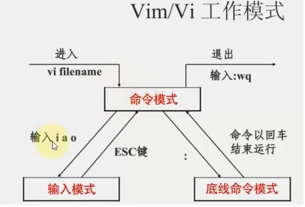

# Linux 基础命令

## 目录结构

采用树结构来存储文件，所有的文件都基于根目录（用一个/表示）

路径层级用"/"来表示，eg:```/usr/local/hello.txt```

## 命令与命令行

每一个命令就是一个Linux程序

命令格式：```command [-options] [parameter]```

* command：命令本身
* -options：可选的行为细节
* parameter：可选的参数

## ls命令

作用：列出目录下的内容（类似于打开文件夹的操作）

```ls [-a -l -h] [Linux路径]```

无参数情况下，会直接列出当前工作目录下的所有文件

### 工作目录与home

Linux在使用时必须要打开一个工作目录，打开终端是的默认目录就是HOME目录。

每个Linux用户的个人账户目录，路径在```/home/username```

### -options

* -a:展示所有的包括隐藏的目录（对于Linux系统，.开头的文件会隐藏）
* -l:以列表的形式显示详细信息
* -h:通过易于阅读的方式列出文件的大小信息。要与l混合使用

混合使用：-l-a 或 -la

## cd命令

作用：切换工作目录

```cd [Linux路径]```

不给路径时，就是回到HOME目录

## pwd命令

查看当前的工作目录

```pwd //无选项无参数```

## 相对路径与绝对路径

使用cd命令时，绝对路径是以根目录为起点，描述以/开头，而相对路径则是以当前工作目录为起点。

特殊路径符
* .:表示当前目录下
* ..:表示切换到上一级目录
* ~:表示HOME目录

eg：回到上上一个目录```cd ../..```

## mkdir创建目录命令

```mkdir [-p] [Linux路径]```在指定路径（相对于绝对均可）下创建文件夹

-p选项表示可以自动创建路径中不存在的父目录

mkdir操作必须在HOME目录内，否则没有权限

## touch,cat,more

### touch

```touch [Linux路径]```创建一个文件

区分文件夹和文件：d代表文件叫，-代表文件

### cat和more

```cat [Linux路径]```作用：查看文件内容，直接显示所有内容

```more [Linux路径]```对于文件内容过多的情况，支持通过spaces翻页，通过Q来退出

## cp,mv,rm

### cp

```cp [-r] 参数1 参数2```用于复制文件和文件夹

* -r：复制文件夹的选项
* 参数1：被复制的内容路径
* 参数2：要去的路径（可以直接重命名）

### mv

```mv 参数1 参数2```移动文件或文件夹。参数1表示被移动的，参数2表示要去的位置，如果目标不存在，则会进行改名。

### rm(remove)

```rm [-r -f] 参数1 参数2 ···```用于删除文件和文件夹，其中每个参数都表示要删除的目标路径

* -r：用于删除文件夹
* -f：管理员用户用于强制删除

#### 通配符

*表示通配符，用来匹配任意内容（包含空）。eg：

* test*：以test开头的内容
* *test：以test结尾
* *test\*：包含test

rm命令就可以使用通配符来辅助操作

## whichi,find

### which

```which 要查找的命令```，可以找到我们使用的命令的程序文件

### find

```find 起始路径 -name "文件名"```，从其实路径开始查找所有对应文件的文件。eg：```find /home/sakanaction -name "*test\*```查找HOME目录下名称中含有test的文件

同样支持通配符进行模糊匹配

```find 起始路径 -size +|-n[kMG]```按文件大小进行搜索。+/-表示大于或小于，kMG表示单位kb、MB，GB。

## grep，wc，管道符

### grep

```grep [-n] 关键字 文件路径```可以从文件中通过关键字来过滤出文件行。其中-n表示是否在结果中显示匹配的行号。

### wc

```wc [-c -m -l -w] 文件路径```统计文件的行数、单词数量等

* -c：字节数
* -m：字符数
* -l：行数
* -w：词数

### 管道符 |

以管道符左侧的命令作为管道符右侧命令的输入。eg：```cat test.txt | grep keyword | wc -l```统计test.txt文件中有keyword关键字的行数

## echo，反引号，重定向符，tail

### echo

```echo "···"```直接在命令行输出内容

### 反引号`

`包围的内容会被看做命令

### 重定向符>,>>

\>将左侧命令的内容覆盖写入右侧的文件，\>>将左侧的结果追加写入右侧文件

### tail

```tail [-f -num] 文件路径```表示查看文件的尾部num行，-f表示持续追踪

## vi/vim编辑器

* 命令模式：所有的输入被视为命令，可以使用各种快捷指令
* 输入模式：所有的输入都是文本编辑
* 底线命令模式：进行保存、退出

### 命令模式
* i:从当前光标后进入输入模式

### 底线命令模式
* w：保存
* q：退出
* wq：保存并退出
* set nu：显示行号



